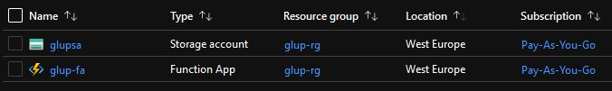
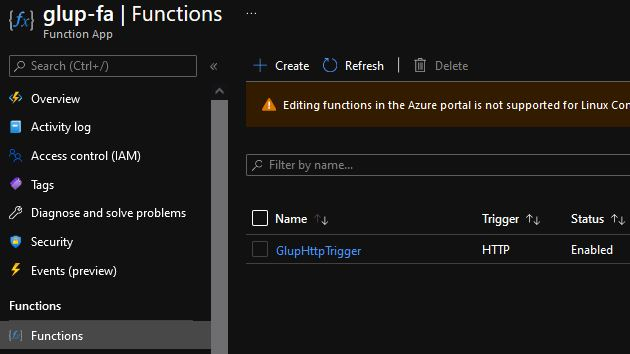

# Deploying the Function App to Azure

This tutorial shows how to create the necessary resources and publish our local function app to Azure using **Azure CLI** and **Azure Functions Core tools**.

## Create resources

We need to create several dependent resources to deploy the function app to Azure.
- Resource group
- Storage account
- Function app

**Log in to Azure**
```powershell
az login
```
Log in to your account using a web browser.

**Create variables**
```powershell
$resourceGroupName="glup-rg"
$storageName="glupsa"
$functionAppName="glup-fa"
$region="westeurope"
```
Function app and storage account names must be globally unique. Storage account name must only consist of alphanumeric characters.

**Create resource group**
```powershell
az group create `
  --name $resourceGroupName `
  --location $region
```

**Create storage account**
```powershell
az storage account create `
  --name $storageName `
  --location $region `
  --resource-group $resourceGroupName `
  --sku Standard_LRS
```

**Create function app**
```powershell
az functionapp create `
  --name $functionAppName `
  --storage-account $storageName `
  --consumption-plan-location $region `
  --resource-group $resourceGroupName `
  --functions-version 3 `
  --runtime python `
  --runtime-version 3.8 `
  --os-type Linux `
  --disable-app-insights true
```

You can verify the successful resource creation by viewing them in the portal.



## Publish function app to Azure

```powershell
func azure functionapp publish $functionAppName --python
```

```powershell
...
Deployment successful.
Remote build succeeded!
Syncing triggers...
Functions in glup-fa:
    GlupHttpTrigger - [httpTrigger]
        Invoke url: https://glup-fa.azurewebsites.net/api/gluphttptrigger
```

This will take a couple of minutes. Confirm that the function was uploaded by opening the *Functions* blade in the function app menu.



## Test the deployment

Call the deployed function using Postman to ensure the deployment went as it should.
```
https://glup-fa.azurewebsites.net/api/gluphttptrigger
```

The first request may involve a considerable delay.


Congratulations! You have successfully deployed a machine learning application as a serverless function app :smile_cat::eyeglasses:

## Next steps

[5 - Summary](05-summary.md)
