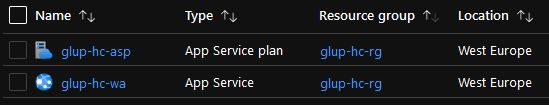
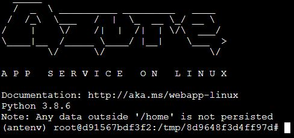

# Deploying the Flask Application to Azure

This tutorial shows how to create the necessary resources and publish our local Flask application to Azure using **Azure CLI**.

## Create resources

We need to create several dependent resources to deploy the application to Azure.
- Resource group
- App service plan
- Web app

**Log in to Azure**
```powershell
az login
```
Log in to your account using a web browser.

**Create variables**


```powershell
$resourceGroupName="glup-hc-rg"
$appServicePlanName="glup-hc-asp"
$webAppName="glup-hc-wa"
$region="westeurope"
```
Web application name must be globally unique. 

**Create resource group**
```powershell
az group create `
  --name $resourceGroupName `
  --location $region
```

**Create app service plan**
```powershell
az appservice plan create `
  --name $appServicePlanName `
  --resource-group $resourceGroupName `
  --location $region `
  --is-linux `
  --sku B1
```
**NB**: The app service plan applies the non-free [Basic service plan B1](https://azure.microsoft.com/en-us/pricing/details/app-service/windows/). The TensorFlow package installation requires storage that might exceed the specifications given by the Free service plan. However, we can update service plan tier once the requirements are installed, resulting in zero or close to zero cost.

**Create and deploy web app**
```powershell
az webapp up `
  --name $webAppName `
  --resource-group $resourceGroupName `
  --plan $appServicePlanName `
  --location $region `
  --sku B1 `
  --runtime "python:3.8"
```
This may take up to 15 minutes to complete. 

You can verify the successful resource creation by viewing them in the portal.



**Optional: Downgrade app service plan to free tier F1**
```powershell
az appservice plan update `
  --name $appServicePlanName `
  --resource-group $resourceGroupName `
  --sku F1
```

**Optional: Add additional dependencies for OpenCV**

If the OpenCV package is one of your application requirements, you must perform several more steps for it to be properly installed on the Linux app virtual environment.
1. Wait until everything is deployed.
2. Open the app service URL and wait for the app to be initialized. Following the example a *404 Not Found* page should be displayed: [https://**glup-hc-wa**.azurewebsites.net/](https://glup-hc-wa.azurewebsites.net/)
3. Open the Web SSH Console: [https://**glup-hc-wa**.scm.azurewebsites.net/webssh/host](https://glup-hc-wa.scm.azurewebsites.net/webssh/host)
4. Install the dependencies listed.

```shell
(antenv) apt-get update && apt-get install -y libglib2.0-0 libsm6 libxext6 libxrender-dev
```




## Test the deployment

Call the deployed function using Postman to ensure the deployment went as it should.
```
https://glup-hc-wa.azurewebsites.net
```


Congratulations! You have successfully deployed a machine learning application as a hosted app service :smile_cat::eyeglasses:

## Next steps

[5 - Summary](05-summary.md)

