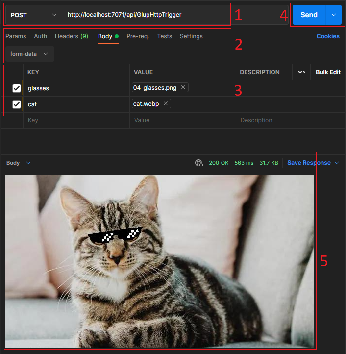

# Postman Requests with Images

The following list displays the necessary steps to process HTTP requests consisting of images with [Postman](https://www.postman.com/downloads/).

1. Choose API method `POST`and paste the API URL: `http://localhost:7071/api/GlupHttpTrigger`.
2. Press `Body - form-data`.
3. Choose `File` instead of `Text` and upload the image in `VALUE`. Add a suitable `KEY` value.
4. Press `Send`.
5. Wait for the API response.

## Back to the tutorial

[3 - Function app: Adding application functionality](03-fa-add-functionality.md)

or

[3 - Flask: Adding application functionality](03-flask-add-functionality.md)
